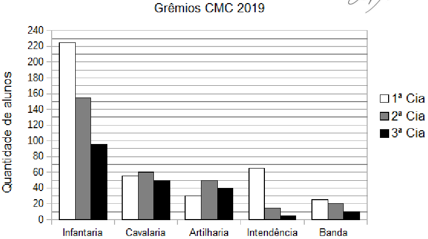

# Questão 1

Ao ingressar em um Colégio Militar, cada aluno escolhe um único grêmio estudantil para fazer parte. No ano de 2019, os 900 alunos matriculados no Colégio Militar de Curitiba (CMC) escolheram entre os grêmios da Infantaria, da Cavalaria, da Artilharia, da Intendência e da Banda. Além disso, o colégio organiza os alunos em três companhias (Cia). Os 200 alunos de 6º e 7º anos compõem a 3ª Cia; os 300 alunos de 8º e 9º anos compõem a 2ª Cia e os 400 alunos do Ensino Médio compõem a 1ª Cia. O gráfico abaixo apresenta a quantidade de alunos de cada uma das companhias distribuídos nos cinco diferentes grêmios estudantis do CMC no ano de 2019.

Com base nas informações fornecidas é correto afirmar que:

(A) a maioria dos alunos da 2ª Cia escolheu o grêmio da Cavalaria.

(B) o grêmio da Intendência tem mais componentes que o grêmio da Artilharia.

(C) o grêmio da Infantaria tem mais alunos da 1ª Cia do que da 2ª e 3ª Cia juntas.

(D) na 3ª Cia, a Banda possui menos integrantes do que o grêmio da Intendência.

(E) há mais alunos da 1ª Cia no grêmio da Intendência do que o total de alunos da Banda.

  
Resolução

 
  ## Resolução
  
  Esta é uma questão de interpretação de gráficos. É preciso ler as alternativas e verificar se ela é verdadeira ou falsa.

  Uma forma de organizar os dados é colocar em forma de tabela. Como existem alternativas que comparam grêmios inteiros ou Cias inteiras, vamos calcular os totais também:

  \\(
    \begin{array}{|c|c|c|c|c|c|c|}
      \hline
      & \text{Infantaria} & \text{Cavalaria} & \text{Artilharia} & \text{Intendência} & 
      \text{Banda} & \text{Total da Cia}\\\\
      \hline
      \text{1ª Cia}           & 225 &  55 &  30 &  65 & 25 & 400 \\\\
      \text{2ª Cia}           & 155 &  60 &  50 &  35 & 20 & 320 \\\\
      \text{3ª Cia}           &  95 &  50 &  40 &   5 & 10 & 200 \\\\
      \hline
      \text{Total do Grêmio}  & 505 & 165 & 120 & 105 & 55 & \\\\
      \hline
    \end{array}
  \\)

  Vamos avaliar cada uma das alternativas:
  
  Alternativa (A): Ao observar somente os dados da 2ª Cia, é fácil notar que o grêmio mais escolhido é o da Infantaria, com 155 alunos. A Cavalaria é o segundo mais escolhido, com 60 alunos, logo esta alternativa é falsa.
  \\(
    \begin{array}{|c|c|c|c|c|c|c|}
      \hline
      & \text{Infantaria} & \text{Cavalaria} & \text{Artilharia} & \text{Intendência} & 
      \text{Banda} & \text{Total da Cia}\\\\
      \hline
      \text{1ª Cia}           & 225 &  55 &  30 &  65 & 25 & 400 \\\\
      \text{2ª Cia}           & \fbox{155} &  \fbox{60} &  50 &  35 & 20 & 320 \\\\
      \text{3ª Cia}           &  95 &  50 &  40 &   5 & 10 & 200 \\\\
      \hline
      \text{Total do Grêmio}  & 505 & 165 & 120 & 105 & 55 & \\\\
      \hline
    \end{array}
  \\)

  Alternativa (B): Comparando os totais da Intendência (105) com da Artilharia (120), também concluímos que esta alternativa é falsa.
  \\(
    \begin{array}{|c|c|c|c|c|c|c|}
      \hline
      & \text{Infantaria} & \text{Cavalaria} & \text{Artilharia} & \text{Intendência} & 
      \text{Banda} & \text{Total da Cia}\\\\
      \hline
      \text{1ª Cia}           & 225 &  55 &  30 &  65 & 25 & 400 \\\\
      \text{2ª Cia}           & 155 &  60 &  50 &  35 & 20 & 320 \\\\
      \text{3ª Cia}           &  95 &  50 &  40 &   5 & 10 & 200 \\\\
      \hline
      \text{Total do Grêmio}  & 505 & 165 & \fbox{120} & \fbox{105} & 55 & \\\\
      \hline
    \end{array}
  \\)

  Alternativa (C): O grêmio da Infantaria possui 225 alunos da 1ª Cia, e somando os alunos da 2ª Cia (155) com a 3ª Cia (95), temos 250 alunos, então esta alternativa também é falsa.
  \\(
    \begin{array}{|c|c|c|c|c|c|c|}
      \hline
      & \text{Infantaria} & \text{Cavalaria} & \text{Artilharia} & \text{Intendência} & 
      \text{Banda} & \text{Total da Cia}\\\\
      \hline
      \text{1ª Cia}           & \fbox{225} &  55 &  30 &  65 & 25 & 400 \\\\
      \text{2ª Cia}           & \fbox{155} &  60 &  50 &  35 & 20 & 320 \\\\
      \text{3ª Cia}           &  \fbox{95} &  50 &  40 &   5 & 10 & 200 \\\\
      \hline
      \text{Total do Grêmio}  & 505 & 165 & 120 & 105 & 55 & \\\\
      \hline
    \end{array}
  \\)

  Alternativa (D): Na 3ª Cia, são 10 alunos na Banda e 5 alunos na Intendência, logo, falsa também.
  \\(
    \begin{array}{|c|c|c|c|c|c|c|}
      \hline
      & \text{Infantaria} & \text{Cavalaria} & \text{Artilharia} & \text{Intendência} & 
      \text{Banda} & \text{Total da Cia}\\\\
      \hline
      \text{1ª Cia}           & 225 &  55 &  30 &  65 & 25 & 400 \\\\
      \text{2ª Cia}           & 155 &  60 &  50 &  35 & 20 & 320 \\\\
      \text{3ª Cia}           &  95 &  50 &  40 &   \fbox{5} & \fbox{10} & 200 \\\\
      \hline
      \text{Total do Grêmio}  & 505 & 165 & 120 & 105 & 55 & \\\\
      \hline
    \end{array}
  \\)

  Alternativa (E): Como as anteriores são falsas, só restou esta como verdadeira, certo? Mas é bom conferir. Os alunos da Intendência da 1ª Cia são 65. O total da Banda é 55, então esta alternativa é verdadeira mesmo.
  \\(
    \begin{array}{|c|c|c|c|c|c|c|}
      \hline
      & \text{Infantaria} & \text{Cavalaria} & \text{Artilharia} & \text{Intendência} & 
      \text{Banda} & \text{Total da Cia}\\\\
      \hline
      \text{1ª Cia}           & 225 &  55 &  30 &  \fbox{65} & 25 & 400 \\\\
      \text{2ª Cia}           & 155 &  60 &  50 &  35 & 20 & 320 \\\\
      \text{3ª Cia}           &  95 &  50 &  40 &   5 & 10 & 200 \\\\
      \hline
      \text{Total do Grêmio}  & 505 & 165 & 120 & 105 & \fbox{55} & \\\\
      \hline
    \end{array}
  \\)

  > Resposta: Alternativa (E)

