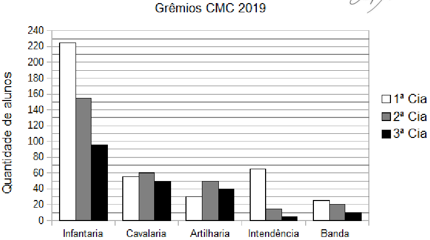

# Questão 1

Ao ingressar em um Colégio Militar, cada aluno escolhe um único grêmio estudantil para fazer parte. No ano de 2019, os 900 alunos matriculados no Colégio Militar de Curitiba (CMC) escolheram entre os grêmios da Infantaria, da Cavalaria, da Artilharia, da Intendência e da Banda. Além disso, o colégio organiza os alunos em três companhias (Cia). Os 200 alunos de 6º e 7º anos compõem a 3ª Cia; os 300 alunos de 8º e 9º anos compõem a 2ª Cia e os 400 alunos do Ensino Médio compõem a 1ª Cia. O gráfico abaixo apresenta a quantidade de alunos de cada uma das companhias distribuídos nos cinco diferentes grêmios estudantis do CMC no ano de 2019.

Com base nas informações fornecidas é correto afirmar que:

(A) a maioria dos alunos da 2ª Cia escolheu o grêmio da Cavalaria.

(B) o grêmio da Intendência tem mais componentes que o grêmio da Artilharia.

(C) o grêmio da Infantaria tem mais alunos da 1ª Cia do que da 2ª e 3ª Cia juntas.

(D) na 3ª Cia, a Banda possui menos integrantes do que o grêmio da Intendência.

(E) há mais alunos da 1ª Cia no grêmio da Intendência do que o total de alunos da Banda.