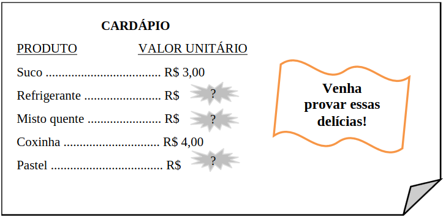

# Questão 2

Maria Fernanda foi a uma lanchonete para fazer um lanche. Chegando lá, quando pegou o cardápio, percebeu que havia algumas informações apagadas, como mostra a figura a seguir, na qual para cada produto é apresentado o seu respectivo valor unitário.

Enquanto esperava para fazer seu pedido, Maria Fernanda verificou que três pessoas foram ao caixa para pagar suas contas. A primeira delas consumiu dois mistos quentes e um suco, gastando, ao todo, R$ 17,00. A segunda pessoa consumiu um refrigerante e dois pastéis, gastando, ao todo, R$ 17,00. Já a terceira consumiu um refrigerante, uma coxinha e um misto quente, gastando, ao todo, R$ 16,00. Maria Fernanda, então, fez o seu lanche, tomando um refrigerante e comendo um misto quente e dois pastéis.

Qual o valor pago por Maria Fernanda pelo lanche?

(A) R$ 20,00

(B) R$ 24,00

(C) R$ 21,00

(D) R$ 28,00

(E) R$ 25,00