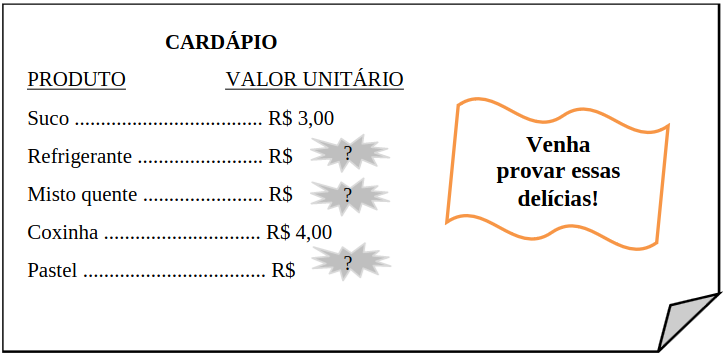

# Questão 2

Maria Fernanda foi a uma lanchonete para fazer um lanche. Chegando lá, quando pegou o cardápio, percebeu que havia algumas informações apagadas, como mostra a figura a seguir, na qual para cada produto é apresentado o seu respectivo valor unitário.

Enquanto esperava para fazer seu pedido, Maria Fernanda verificou que três pessoas foram ao caixa para pagar suas contas. A primeira delas consumiu dois mistos quentes e um suco, gastando, ao todo, R$ 17,00. A segunda pessoa consumiu um refrigerante e dois pastéis, gastando, ao todo, R$ 17,00. Já a terceira consumiu um refrigerante, uma coxinha e um misto quente, gastando, ao todo, R$ 16,00. Maria Fernanda, então, fez o seu lanche, tomando um refrigerante e comendo um misto quente e dois pastéis.

Qual o valor pago por Maria Fernanda pelo lanche?

(A) R$ 20,00

(B) R$ 24,00

(C) R$ 21,00

(D) R$ 28,00

(E) R$ 25,00

  
Resolução

 
  ## Resolução
  Existem 3 valores que não conhecemos, os preços do Refrigerante (R), do Misto Quente (M) e do Pastel (P). Podemos usar as informações dadas para escrever equações envolvendo essas quantidades desconhecidas:

  "A primeira delas consumiu dois mistos quentes e um suco, gastando, ao todo, R$ 17,00":

  \\( 2 \times M + \text{Suco} = 17 \\)
  
  Aqui usamos o valor conhecido do Suco (R$ 3,00). Vamos resolver para achar M:

  \\(
    \begin{align}
      2 \times M + 3 &= 17 \\\\
      2 \times M     &= 17 - 3 \\\\
      2 \times M     &= 14 \\\\
      M              &= \displaystyle \frac{14}{2} \\\\
      M              &= 7
    \end{align}  
  \\)

  E encontramos o preço do Misto Quente: R$ 7,00. Vamos ver outras informações:

  "A segunda pessoa consumiu um refrigerante e dois pastéis, gastando, ao todo, R$ 17,00"
  
  \\( R + 2 \times P = 17 \\)

  Como não sabemos os valores de R nem P, é melhor vermos o que tem na próxima:

  "Já a terceira consumiu um refrigerante, uma coxinha e um misto quente, gastando, ao todo, R$ 16,00"

  \\( R + \text{Coxinha} + \text{Misto Quente} = 16 \\)

  OK, aqui já usamos o valor conhecido da Coxinha (R$ 4,00) e o valor calculado do Misto Quente (R$ 7,00):

  \\( 
    \begin{align}
      R + 4 + 7 &= 16 \\\\
      R + 11 &= 16 \\\\
      R &= 16 - 11 \\\\
      R &= 5
    \end{align}
  \\)

  Muito bem, calculamos aqui que o Refrigerante custa R$ 5,00, e podemos retornar na equação anterior:
  
  \\( 
    \begin{align}
    R + 2 \times P &= 17 \\\\
    5 + 2 \times P &= 17 \\\\
    2 \times P     &= 17 - 5 \\\\
    2 \times P     &= 12 \\\\
    P              &= \displaystyle \frac{12}{2} \\\\
    P              &= 6
    \end{align}  
  \\)

  Pronto, achamos o preço do Pastel, R$ 6,00.

  A questão pede o valor da conta da Maria Fernanda, que consumiu 1 Refrigerante, 1 Misto Quente e 2 Pastéis:

  \\(
    \begin{equation}
      R + M + 2 \times P\\\\
      = 5 + 7 + 2 \times 6\\\\
      = 12 + 12\\\\
      = 24 
    \end{equation}  
  \\)

  > Resposta: Alternativa (B)

