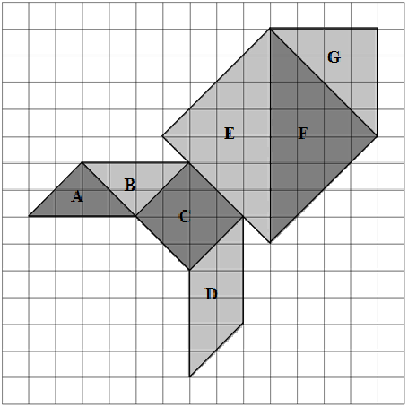
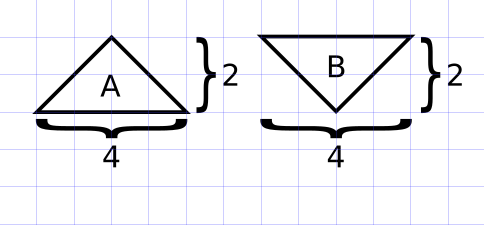
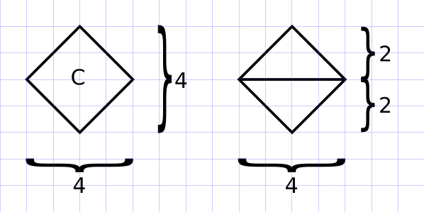
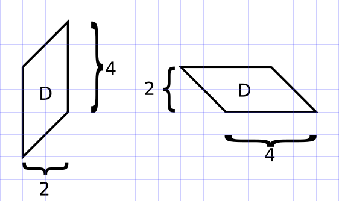
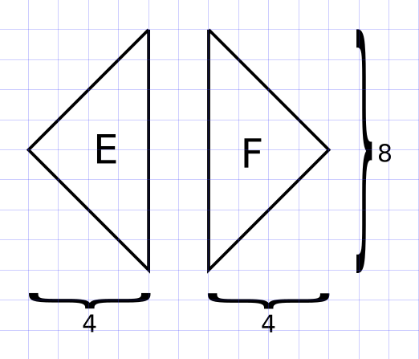
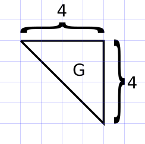

# Questão 6

Na malha quadriculada de 15x15 quadradinhos, ilustrada abaixo, está desenhada uma figura construída a partir das sete peças de um Tangram e identificadas cada uma com uma letra.

Considere que todos os quadradinhos da malha quadriculada possuem a mesma área.
Observe as áreas identificadas na figura e considere as afirmações a seguir:

I - A área de F é igual à soma das áreas de A, de B e de G.

II - A área de C é 50% da área de E.

III - A área de D é 50% da soma das áreas de E e de A.

IV - A soma das áreas de E e de F é igual à soma das áreas de A, de B, de C e de D.

V - A soma das áreas de D e de A é igual à área de G.

VI - A área de G é igual à soma das áreas de A e de B.

São verdadeiras somente as afirmações:

(A) I, II, V e VI.

(B) I, II e VI.

(C) I, III, V.

(D) II, III e IV.

(E) II, V e VI.

  
Resolução

  ## Resolução

  Para resolver, é preciso conhecer as formas de calcular áreas de quadriláteros e triângulos.

  Quadriláteros: \\( \text{Área} = \text{base} \times \text{altura} \\)

  Triângulos: \\( \text{Área} = \displaystyle \frac{\text{base} \times \text{altura}}{2}\\)

  Agora, vamos às figuras. Os triângulos A e B são congruentes, de base 4 e altura 2. Assim, a área de ambos é igual a \\( \displaystyle \frac{4 \times 2}{2} = 4\\).

  

  O quadrado C pode ser dividido em 2 triângulos de base 4 e altura 2, logo a área é igual a \\( 2 \times \displaystyle \frac{4 \times 2}{2} = 2 \times 4 = 8\\).

  

  O paralelogramo D possui base 4 e altura 2, logo área igual a \\(4 \times 2 = 8\\).

  

  Os triângulos E e F são congruentes, de base 8 e altura 4, logo área igual a \\( \displaystyle\frac{8 \times 4}{2} = 16 \\).

  

  O triângulo G tem base 4 e altura 4, logo área igual a \\( \displaystyle \frac{4 \times 4}{2} = 8 \\).

  

  Também podemos tabelar esses valores para avaliar mais facilmente as afirmações:

  \\(
    \begin{array}{|c|c|c|c|c|c|c|}
    \hline
    A & B & C & D & E & F & G \\\\
    \hline
    4 & 4 & 8 & 8 & 16 & 16 & 8 \\\\
    \hline 
    \end{array}
  \\)

  "I - A área de F é igual à soma das áreas de A, de B e de G." - **Verdadeira** (16 = 4 + 4 + 8)

  "II - A área de C é 50% da área de E." - **Verdadeira** (8 = 50% de 16)

  "III - A área de D é 50% da soma das áreas de E e de A." - **Falsa** (A + E = 4 + 16 = 20, e 50% de 20 é 10, e não 8)

  "IV - A soma das áreas de E e de F é igual à soma das áreas de A, de B, de C e de D." - **Falsa** (E + F = 16 + 16 = 32. A + B + C = 4 + 4 + 8 = 16).

  "V - A soma das áreas de D e de A é igual à área de G." - **Falsa** (D + A = 8 + 4 = 12, e G = 8)

  "VI - A área de G é igual à soma das áreas de A e de B." - **Verdadeira** (8 = 4 + 4)

  > Resposta: Alternativa (B)

