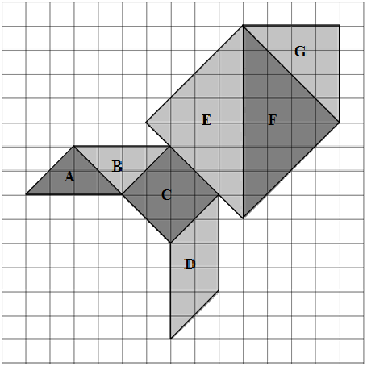

# Questão 6

Na malha quadriculada de 15x15 quadradinhos, ilustrada abaixo, está desenhada uma figura construída a partir das sete peças de um Tangram e identificadas cada uma com uma letra.

Considere que todos os quadradinhos da malha quadriculada possuem a mesma área.
Observe as áreas identificadas na figura e considere as afirmações a seguir:

I - A área de F é igual à soma das áreas de A, de B e de G.

II - A área de C é 50% da área de E.

III - A área de D é 50% da soma das áreas de E e de A.

IV - A soma das áreas de E e de F é igual à soma das áreas de A, de B, de C e de D.

V - A soma das áreas de D e de A é igual à área de G.

VI - A área de G é igual à soma das áreas de A e de B.

São verdadeiras somente as afirmações:

(A) I, II, V e VI.

(B) I, II e VI.

(C) I, III, V.

(D) II, III e IV.

(E) II, V e VI.