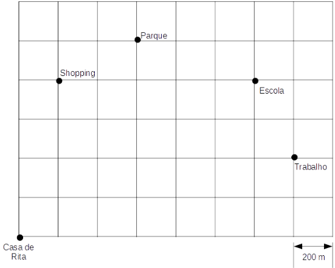

# Questão 12

Na malha quadriculada a seguir, está representada parte da cidade onde Rita mora com sua filha. As linhas representam as ruas da cidade e os quadrados da malha representam os quarteirões. Ao caminhar pelas ruas da cidade, uma pessoa percorre 200m a cada lado do quarteirão, como mostrado na figura. Na malha também estão identificados alguns locais que fazem parte da rotina de Rita e de sua filha, como pode ser observado a seguir.

Curiosa para saber a distância que percorre semanalmente, Rita elaborou uma lista com sua rotina semanal. De segunda a sexta-feira, Rita sai de casa para o trabalho e do trabalho passa para pegar a filha na escola, voltando diretamente para casa. No sábado, Rita vai de casa até o parque com a sua filha e retorna diretamente para casa. No domingo, Rita vai até o shopping e retorna diretamente para casa.

A fim de cumprir sua rotina, Rita percorre sempre a menor distância, andando pela calçada e sem atravessar o quarteirão pelo meio (diagonal). Assim, em uma semana completa (de domingo a sábado), sem alterações de rotina, Rita percorre um total de:

(A) 27.200 km.

(B) 27,2 m.

(C) 27,2 km.

(D) 9.600 km.

(E) 9,6 km.