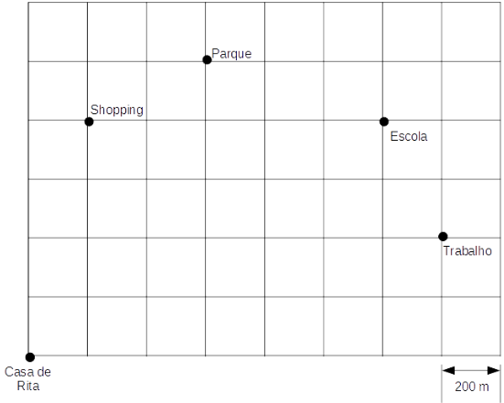
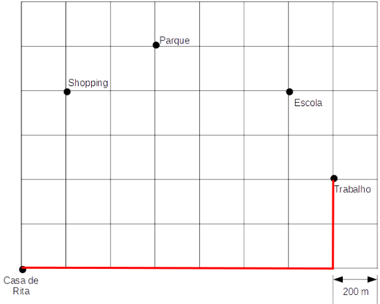
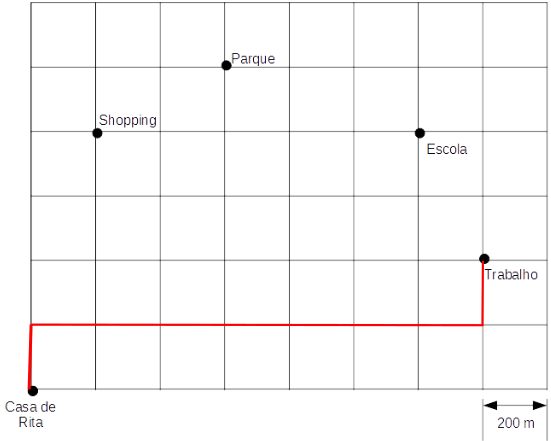
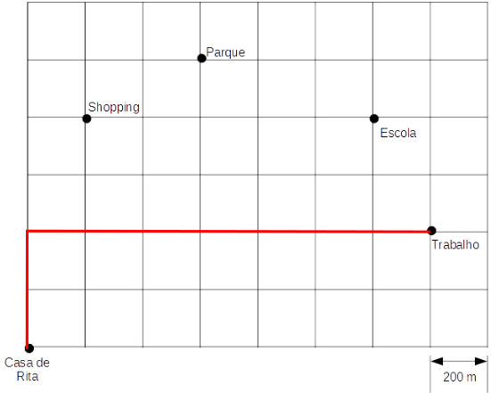
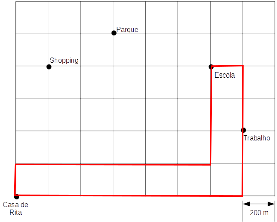
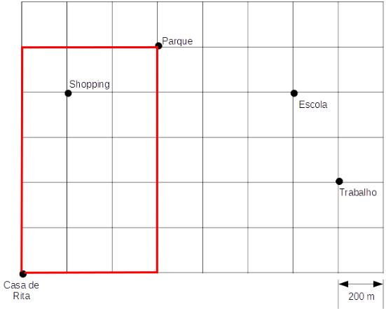
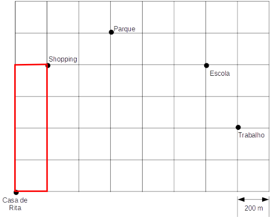

# Questão 12

Na malha quadriculada a seguir, está representada parte da cidade onde Rita mora com sua filha. As linhas representam as ruas da cidade e os quadrados da malha representam os quarteirões. Ao caminhar pelas ruas da cidade, uma pessoa percorre 200m a cada lado do quarteirão, como mostrado na figura. Na malha também estão identificados alguns locais que fazem parte da rotina de Rita e de sua filha, como pode ser observado a seguir.

Curiosa para saber a distância que percorre semanalmente, Rita elaborou uma lista com sua rotina semanal. De segunda a sexta-feira, Rita sai de casa para o trabalho e do trabalho passa para pegar a filha na escola, voltando diretamente para casa. No sábado, Rita vai de casa até o parque com a sua filha e retorna diretamente para casa. No domingo, Rita vai até o shopping e retorna diretamente para casa.

A fim de cumprir sua rotina, Rita percorre sempre a menor distância, andando pela calçada e sem atravessar o quarteirão pelo meio (diagonal). Assim, em uma semana completa (de domingo a sábado), sem alterações de rotina, Rita percorre um total de:

(A) 27.200 km.

(B) 27,2 m.

(C) 27,2 km.

(D) 9.600 km.

(E) 9,6 km.

## Resolução

Para ir de um lugar para outro, como por exemplo, de casa para o trabalho, Rita pode seguir vários trajetos possíveis, mas só importa para nós o número mínimo de quadras que ela anda. Por exemplo, nesses 3 trajetos:

A distância percorrida é a mesma, pois Rita andou 2 quadras para "cima" e 7 quadras apara a "direita", totalizando 9 quadras. Este tipo de distância é chamada de distância Manchester.

Existem outros trajetos de mínima distância possíveis, vamos escolher apenas 1 deles para fazer a resolução, bastando que ao ir de um local para outro, não se "volte" uma quadra para uma direção oposta.

Assim, vamos traçar um trajeto para os dias úteis, um para o sábado e um para o domingo.

Dias úteis (22 quadras, ou 4.400 m cada dia):

Sábado (16 quadras, ou 3.200 m):

Domingo (10 quadras, ou 2.000 m):

Assim, são 5 x 4.400 + 3.200 + 2.000 = 22.000 + 5.200 = 27.200 m percorridos durante toda a semana. Não existe a alternativa com 27.200 m, mas existe a 27.2 km, que é a mesma coisa.

> Resposta: Alternativa (C)
