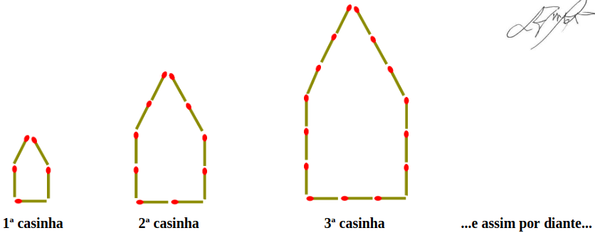

# Questão 14

Um garoto aproveitou o tempo livre no apartamento onde mora e resolveu montar casinhas em forma de pentágono, utilizando palitos de fósforo, seguindo o padrão ilustrado na figura abaixo. O primeiro pentágono tem lado medindo o comprimento de um palito de fósforo, o segundo tem lado medindo dois palitos de fósforo, o terceiro tem lado medindo três palitos de fósforo e assim por diante, sempre aumentando a medida do lado em um palito de fósforo de uma figura para a outra.

O garoto construiu casinhas até que os fósforos que sobraram não eram suficientes para construir a próxima casinha.

Sabe-se que:

I - uma caixa de fósforos cheia tem 40 palitos cada;

II - a primeira caixa de fósforos que o garoto utilizou tinha somente \\( \displaystyle \frac{5}{8} \\) do total de palitos;

III - sem desmanchar nenhuma casinha já montada, o garoto conseguiu construir 15 delas.

Considerando a situação descrita e as informações apresentadas, pode-se afirmar que o garoto tinha:

(A) 14 caixas de fósforo completamente cheias e faltaram 25 palitos de fósforo para ele montar a 16ª casinha.

(B) 14 caixas de fósforo completamente cheias e faltaram 55 palitos de fósforo para ele montar a 16ª casinha.

(C) 15 caixas de fósforo completamente cheias e faltaram 25 palitos de fósforo para ele montar a 16ª casinha.

(D) 15 caixas de fósforo completamente cheias e faltaram 55 palitos de fósforo para ele montar a 16ª casinha.

(E) 15 caixas de fósforo completamente cheias e faltaram 80 palitos de fósforo para ele montar a 16ª casinha.

## Resolução

Observe que o pentágono que forma a primeira casinha utiliza 5 palitos, na segunda casinha são 10 palitos, na terceira são 15 palitos, e assim por diante. Com isso, sabemos que a casinha na posição n utiliza-se de 5n palitos, ou seja, a 15ª casinha utiliza 75 palitos e a 16ª casinha utiliza 80 palitos.

A sequência de palitos crescentes 5, 10, 15, ..., 75 é uma P.A. de termo inicial 5 e razão 5 e 15 termos. Assim, vamos calcular a quantidade de palitos totais para formar 16 casinhas:

\\(\require{cancel}\\)

\\(
  S_n = \displaystyle \frac{(a_1 + a_n) \cdot n}{2} \\
\\)

\\(
  S_{15} = \displaystyle \frac{(5 + 75) \cdot 15}{2} = \frac{\cancelto{40}{80} \cdot 15}{\cancelto{1}{2}} = 40 \cdot 15 = 600
\\)

Sendo 600 palitos para 15 casinhas e 40 palitos por caixa, necessitamos de \\(600 \div 40 = 15\\) caixas. Mas a primeira caixa possuía somente \\(\displaystyle \frac{5}{8}\\) dos palitos, ou seja, \\(\displaystyle \frac{5}{8} \times 40 = 25\\) palitos, logo precisamos desta primeira caixa incompleta mais **15** caixas cheias para conseguir montar as 15 casinhas, sobrando justamente 25 palitos na última caixa. Como a 16ª casinha precisaria de 80 palitos, faltaram **55** palitos para esta casa.

Assim, a alternativa correta é a D

> Resposta: Alternativa (D)

