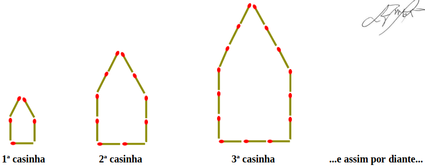

# Questão 14

Um garoto aproveitou o tempo livre no apartamento onde mora e resolveu montar casinhas em forma de pentágono, utilizando palitos de fósforo, seguindo o padrão ilustrado na figura abaixo. O primeiro pentágono tem lado medindo o comprimento de um palito de fósforo, o segundo tem lado medindo dois palitos de fósforo, o terceiro tem lado medindo três palitos de fósforo e assim por diante, sempre aumentando a medida do lado em um palito de fósforo de uma figura para a outra.

O garoto construiu casinhas até que os fósforos que sobraram não eram suficientes para construir a próxima casinha.

Sabe-se que:

I - uma caixa de fósforos cheia tem 40 palitos cada;

II - a primeira caixa de fósforos que o garoto utilizou tinha somente \\( \displaystyle \frac{5}{8} \\) do total de palitos;

III - sem desmanchar nenhuma casinha já montada, o garoto conseguiu construir 15 delas.

Considerando a situação descrita e as informações apresentadas, pode-se afirmar que o garoto tinha:

(A) 14 caixas de fósforo completamente cheias e faltaram 25 palitos de fósforo para ele montar a 16ª casinha.

(B) 14 caixas de fósforo completamente cheias e faltaram 55 palitos de fósforo para ele montar a 16ª casinha.

(C) 15 caixas de fósforo completamente cheias e faltaram 25 palitos de fósforo para ele montar a 16ª casinha.

(D) 15 caixas de fósforo completamente cheias e faltaram 55 palitos de fósforo para ele montar a 16ª casinha.

(E) 15 caixas de fósforo completamente cheias e faltaram 80 palitos de fósforo para ele montar a 16ª casinha.