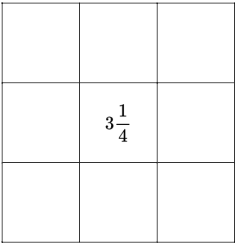
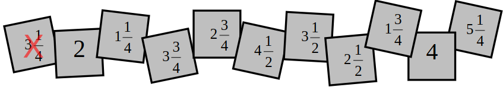
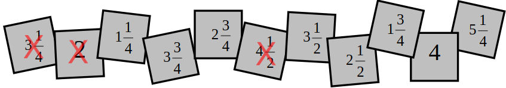
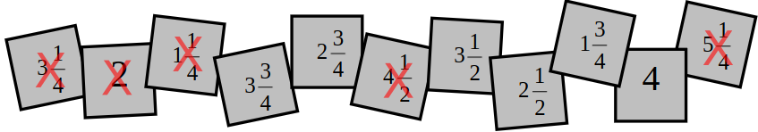
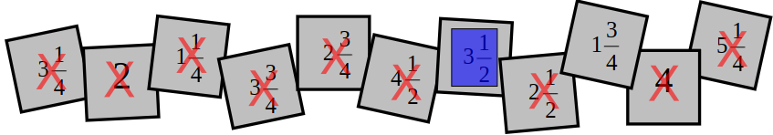
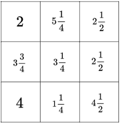

# Questão 15

Estela teve a ideia de construir um quadrado mágico utilizando alguns cartões que traziam a representação de números. Observe a seguir os onze cartões que ela possuía, considerando que eles são quadrados e não estão em escala:

Estela escolheu nove dos onze cartões que possuía, organizando-os, sem nenhuma repetição, em um quadrado mágico com três linhas e três colunas, como representado abaixo.

Nesse quadrado mágico, a soma dos valores dos três números dispostos em cada linha, em cada coluna e em cada diagonal é igual a \\( \displaystyle 9\frac{3}{4} \\). Na posição central, segunda linha e segunda coluna, Estela colocou o valor correspondente a \\( \displaystyle \frac{1}{3} \\) da soma.
Dispondo corretamente os nove números escolhidos, a fim de que a soma \\( \displaystyle 9\frac{3}{4} \\) seja satisfeita em todos os casos, a alternativa que apresenta os dois números não escolhidos por Estela é:

(A) \\( \displaystyle 3\frac{3}{4} \\) e \\( \displaystyle 1\frac{3}{4} \\)

(B) \\( \displaystyle 5\frac{1}{4} \\) e \\( 2 \\)

(C) \\( \displaystyle 3\frac{1}{2} \\) e \\( \displaystyle 1\frac{3}{4} \\)

(D) \\( \displaystyle 2\frac{3}{4} \\) e \\( 4 \\)

(E) \\( \displaystyle 1\frac{1}{4} \\) e \\( \displaystyle 4\frac{1}{2} \\)

## Resolução

Antes, vamos esclarecer que esta notação de \\( \displaystyle 9\frac{3}{4} \\) (nove e três quartos) não é a mesma coisa que \\( \displaystyle 9 \cdot \frac{3}{4} = \frac{27}{4} \\), e sim, igual a \\( \displaystyle 9 + \frac{3}{4} \\).

Vamos colocar primeiro o valor central deste quadrado mágico. Sendo \\( \displaystyle \frac{1}{3} \\) de \\( \displaystyle 9\frac{3}{4} \\), isso é igual a \\( \displaystyle 3\frac{1}{4} \\).

Agora, sabemos que a soma dos outros 2 valores na mesma linha/coluna/diagonal precisa ser igual a \\( \displaystyle \frac{2}{3} \\) de \\( \displaystyle 9\frac{3}{4} \\), ou seja, \\( \displaystyle 6\frac{1}{2} \\). Assim, vamos analisar se para cada um dos cartões restantes existe um outro cartão que faz com que a soma destes 2 cartões resulte em \\( \displaystyle 6\frac{1}{2} \\).

\\(2\\): \\( \displaystyle 6\frac{1}{2} - 2 = 4\frac{1}{2}\\). Bom, eliminamos o \\(\displaystyle 4\frac{1}{2}\\) aqui.

\\(\displaystyle 1\frac{1}{4} \\): \\( \displaystyle 6\frac{1}{2} - 1\frac{1}{4} = 5\frac{1}{4}\\). E aqui eliminamos o \\(\displaystyle 5\frac{1}{4}\\).

\\(\displaystyle 3\frac{3}{4} \\): \\( \displaystyle 6\frac{1}{2} - 3\frac{3}{4} = 2\frac{3}{4}\\). E aqui eliminamos o \\(\displaystyle 2\frac{3}{4}\\).

\\(\displaystyle 3\frac{1}{2} \\): \\( \displaystyle 6\frac{1}{2} - 3\frac{1}{2} = 3\\). como não tem cartão com valor 3, então sabemos que o \\(\displaystyle 3\frac{1}{2} \\) é um dos cartões que não pode ser utilizado.

\\(\displaystyle 2\frac{1}{2} \\): \\( \displaystyle 6\frac{1}{2} - 2\frac{1}{2} = 4\\). E aqui eliminamos o 4.

Portanto, os 2 cartões que não podem ser utilizados são o \\(\displaystyle 3\frac{1}{2} \\) e o \\(\displaystyle 1\frac{3}{4} \\)

> Resposta: Alternativa (C)

Extra: Aqui está um quadrado mágico possível com os 9 cartões escolhidos:

