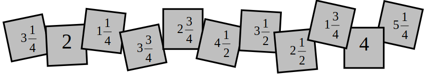
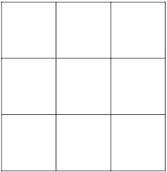

# Questão 15

Estela teve a ideia de construir um quadrado mágico utilizando alguns cartões que traziam a representação de números. Observe a seguir os onze cartões que ela possuía, considerando que eles são quadrados e não estão em escala:

Estela escolheu nove dos onze cartões que possuía, organizando-os, sem nenhuma repetição, em um quadrado mágico com três linhas e três colunas, como representado abaixo.

Nesse quadrado mágico, a soma dos valores dos três números dispostos em cada linha, em cada coluna e em cada diagonal é igual a \\( \displaystyle 9\frac{3}{4} \\). Na posição central, segunda linha e segunda coluna, Estela colocou o valor correspondente a \\( \displaystyle \frac{1}{3} \\) da soma.
Dispondo corretamente os nove números escolhidos, a fim de que a soma \\( \displaystyle 9\frac{3}{4} \\) seja satisfeita em todos os casos, a alternativa que apresenta os dois números não escolhidos por Estela é:

(A) \\( \displaystyle 3\frac{3}{4} \\) e \\( \displaystyle 1\frac{3}{4} \\)

(B) \\( \displaystyle 5\frac{1}{4} \\) e \\( 2 \\)

(C) \\( \displaystyle 3\frac{1}{2} \\) e \\( \displaystyle 1\frac{3}{4} \\)

(D) \\( \displaystyle 2\frac{3}{4} \\) e \\( 4 \\)

(E) \\( \displaystyle 1\frac{1}{4} \\) e \\( \displaystyle 4\frac{1}{2} \\)