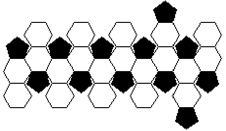
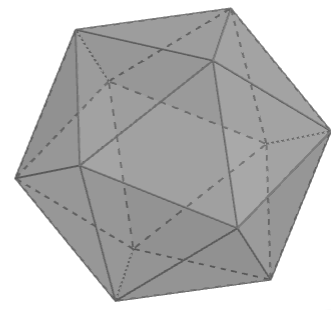
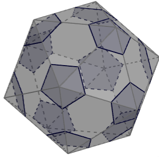
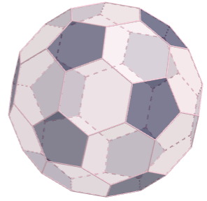

# Questão 16

Uma bola de futebol pode ser representada por um poliedro convexo cujo nome é icosaedro truncado. Esse poliedro é constituído de 20 faces hexagonais e 12 faces pentagonais cujos lados são todos congruentes entre si. Uma possível planificação desse sólido é ilustrada a seguir.

Sabendo-se que nesse poliedro convexo o número de vértices é \\( \displaystyle \frac{2}{3} \\) do número de arestas, é incorreto afirmar que:

(A) o icosaedro truncado possui 60 vértices e 90 arestas.

(B) se cada aresta medisse 8 cm, a soma das medidas de todas as arestas alinhadas seria 7,2 m.

(C) o icosaedro truncado possui 32 faces no total.

(D) a diferença entre o número de arestas e de faces do icosaedro truncado é 60.

(E) o icosaedro truncado possui mais arestas do que vértices.

## Resolução

Temos que analisar cada afirmação e verificar a veracidade. Antes de tudo, vamos entender de onde é que veio essa idéia de "icosaedro truncado". Um icosaedro normal é um poliedro de 20 faces triangulares.

[Gerei imagens fazendo o print deste site (https://www.geogebra.org/m/dkgj35sb)]: #

Cada vértice é conectado a 5 arestas, logo podemos pensar em remover pirâmides de base pentagonal a partir de cada um desses vértices, resultando em faces pentagonais e hexagonais.

E assim chegamos no icosaedro truncado, e é sempre possível recortar as pirâmides de forma que todas as arestas fiquem do mesmo tamanho.

Bom, vamos às afirmações. Como \\(V = \displaystyle \frac{2A}{3}\\), então a afirmação (E) é verdadeira de cara, pois ela diz que \\(A > V\\). Também sabemos que 20 faces hexagonais mais 12 faces pentagonais resultam em 32 faces totais, logo (C) também é verdadeira. Agora precisamos saber a quantidade de arestas e vértices.

Como este icosaedro truncado é um **poliedro convexo**, vale a **relação de Euler**:

\\(V + F = A + 2\\)

V: número de vértices

F: número de faces

A: número de arestas

Novamente, aplicando as relações conhecidas:

\\(\displaystyle \frac{2A}{3} + 32 = A + 2\\)

\\(32 - 2 = A - \displaystyle \frac{2A}{3}\\)

\\(30 = \displaystyle \frac{A}{3}\\)

\\(A = 90\\)

\\(V = \displaystyle \frac{2A}{3} = \frac{2 \cdot 90}{3} = 60\\)

Com isso, a afirmação (A) é verdadeira.

Sabendo que são 90 arestas, caso elas medissem 8 cm cada, a soma dos comprimentos das arestas seria de \\(90 \cdot 8 = 720\\) cm, ou 7,2 m. Portanto, a afirmação (B) é verdadeira.

Só restou então verificar a (D), que afirma que \\(A - F = 60\\), o que é falso, já que \\(A = 90\\) e \\(F = 32\\), logo \\(A - F = 58\\).

> Resposta: Alternativa (D)