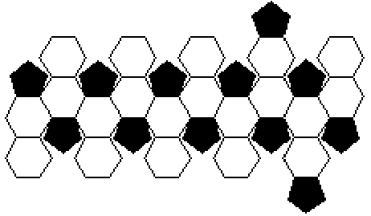

# Questão 16

Uma bola de futebol pode ser representada por um poliedro convexo cujo nome é icosaedro truncado. Esse poliedro é constituído de 20 faces hexagonais e 12 faces pentagonais cujos lados são todos congruentes entre si. Uma possível planificação desse sólido é ilustrada a seguir.

Sabendo-se que nesse poliedro convexo o número de vértices é \\( \displaystyle \frac{2}{3} \\) do número de arestas, é incorreto afirmar que:

(A) o icosaedro truncado possui 60 vértices e 90 arestas.

(B) se cada aresta medisse 8 cm, a soma das medidas de todas as arestas alinhadas seria 7,2 m.

(C) o icosaedro truncado possui 32 faces no total.

(D) a diferença entre o número de arestas e de faces do icosaedro truncado é 60.

(E) o icosaedro truncado possui mais arestas do que vértices.