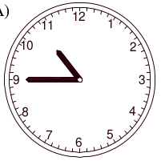
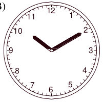
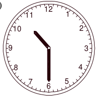
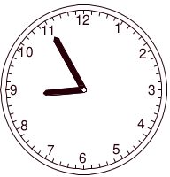

# Questão 18

Um relógio defeituoso adianta 120 segundos a cada 10 minutos. Quando, no horário de Brasília, eram três horas e trinta e três minutos, Ricardo acertou o relógio para esse horário. A partir daí, depois de transcorrido um período de seis horas, Ricardo olhou novamente para o relógio defeituoso e viu que ele indicava:

(A)

(B)

(C)

(D)

(E)

