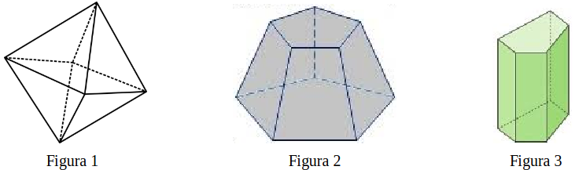

# Questão 19

João Lucas gostava muito de solucionar exercícios relacionados a sólidos geométricos e resolveu aceitar um desafio de seu professor: encontrar a resposta para uma expressão numérica.

Nas figuras, a seguir, estão apresentados três sólidos geométricos.

Considere:

– A o número de arestas da figura 1;

– B o número de vértices da figura 2; e

– C o número de faces da figura 3.

Observe agora a representação de A, B e C na expressão numérica a seguir.

\\[
  \frac{C}{9} \div \left( \frac{\text{1,5} + \displaystyle \frac{2}{3} - \frac{9}{6} - \frac{2}{A}}{\text{1,6} \times \displaystyle  \frac{3}{8} \div 2 + 1 + \text{0,5}} + \frac{1}{3} \times \frac{5}{B}\right)
\\]

Após resolver corretamente a expressão numérica, João Lucas encontrará como resposta o decimal:

(A) 1,75

(B) 17,5

(C) 7,4

(D) 175

(E) 0,74