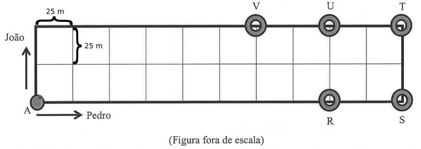

# Questão 3

Buscando manter a forma física, João e Pedro resolveram caminhar regularmente em torno de uma praça cujo formato é retagular. Enquanto João caminha 200 metros, Pedro caminha 100 metros. Ambos mantêm o mesmo ritmo de caminhada durante todo o trajeto. Partindo do mesmo ponto (A) ao mesmo tempo, em direções diferentes conforme indicação das setas na figura abaixo.

Na figura, a praça está dividida em 20 quadrados congruentes cujo perímetro de cada quadrado é 100 m. Em que ponto irão se encontrar pela primeira vez?

(A) V

(B) U

(C) T

(D) S

(E) R

  
Resolução

  
  ## Resolução

  A primeira coisa a se fazer aqui é calcular quanto mede o lado de cada quadrado. Sendo o perímetro igual a 100 m, sabendo que no quadrado são 4 lados iguais, cada lado mede 25 m.
  
  

  Logo, se João caminha 200 m, ele caminha por \\( 200 \div 25 = 8 \\) lados de quadrado, enquanto que Pedro caminha \\( 100 \div 25 = 4 \\) lados de quadrado. Podemos marcar na própria figura esses passos e assim encontrar visualmente a resposta:

  Numa primeira rodada, João andou 8 lados, ou seja, 2 para cima mais 6 para a direita, enquanto Pedro andou 4 lados para a direita:

  

  Numa próxima rodada, João andou mais 8 lados, ou seja, 4 para a direita, 2 para baixo e 2 para a esquerda, e Pedro andou mais 4 lados para a direita:

  

  Assim, o primeiro encontro deles deu-se no ponto R.

  > Resposta: Alternativa (E)

