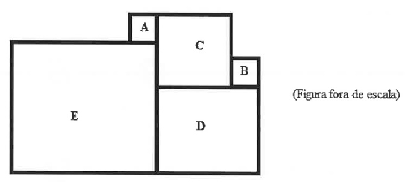

# Questão 4

Marcos está brincando com peças de madeira no formato de quadrados. Em um dado momento, organizou 5 (cinco) quadrados conforme a figura a seguir.

Considere que as peças estejam perfeitamente alinhadas, isso é, não existem espaços entre elas. Sabendo que os perímetros dos quadrados A, B e C são 20 cm, 2 dm e 0,48 m respectivamente, qual a área do quadrado E?

(A) 841 cm²

(B) 576 cm²

(C) 289 cm²

(D) 625 cm²

(E) 1156 cm²

  
Resolução

  
  ## Resolução

  Como as respostas estão em cm², vamos primeiro calcular os lados dos quadrados em cm. Chamemos de *a*, *b*, *c*, *d* e *e* os lados respectivos aos quadrados A, B, C, D e E:

  A: perímetro 20 cm, \\(a = 20 \div 4 = 5 \\) cm

  B: perímetro 2 dm = 20 cm, \\(b = 20 \div 4 = 5\\) cm

  C: perímetro 0,48 m = 48 cm, \\(c = 48 \div 4 = 12\\) cm

  D: visualmente, observamos que o lado do quadrado D é igual à soma dos lados dos quadrados B e C, ou seja, \\(d = b + c = 5 + 12 = 17\\) cm

  E: visualmente, observamos que a soma dos lados dos quadrados A e E é igual à soma dos lados dos quadrados C e D:
  \\[ \begin{equation}
  a + e = c + d \\\\
  e = c + d - a = 12 + 17 - 5 = 24 \text{ cm}
  \end{equation} \\]

  E assim, calculamos a área do quadrado E:

  \\(\text{área do quadrado} = \text{lado}^2 = e^2 = 24^2 = 576 \\) cm²

  > Resposta: Alternativa (B)

