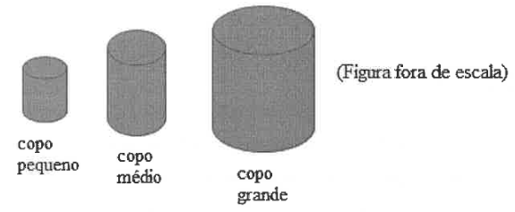

# Questão 5

Na casa de Márcio, existem copos com três diferentes capacidades: um copo pequeno cuja capacidade é de 100 ml, um copo médio e um copo grande.

A capacidade de cada copo pequeno corresponde a \\(\frac{1}{3}\\) da capacidade do copo médio.

O copo médio tem capacidade correspondente a \\(\frac{2}{5}\\) do copo grande.

Estando o copo pequeno cheio de água, o copo médio cheio de água e o copo grande vazio, transferimos, sem perda, toda a água do copo pequeno e do copo médio para o copo grande.

Em relação ao copo grande, podemos afirmar que:

(A) transbordará, pois a capacidade do copo grande é menor que a soma das capacidades dos copos menores.

(B) terá \\(\frac{8}{15}\\) da sua capacidade preenchida pela água.

(C) terá menos da metade de sua capacidade preenchida pela água.

(D) terá exatamente metade da sua capacidade preenchida pela água.

(E) terá \\(\frac{11}{15}\\) da sua capacidade preenchida pela água.

  
Resolução

  
  ## Resolução
  Chamemos de P, M e G as capacidades dos copos pequeno, médio e grande, respectivamente. Já sabemos que P = 100 ml

  Foi dado que \\(P = \frac{M}{3}\\), ou seja, \\(M = 3P = 3 \times 100 = 300\\) ml.

  Também foi dado que \\(M = \frac{2G}{5}\\), ou seja, \\(G = \frac{5M}{2} = \frac{5 \times 300}{2} = 750 \\) ml.

  Ao despejar o conteúdo dos copos pequeno (100 ml) e médio (300 ml) no copo grande, não iremos enchê-lo, pois a soma deles é de 400 ml de água. Isso corresponde à fração de \\( \frac{P+M}{G} = \frac{400}{750} = \frac{8}{15}\\) da capacidade total do copo grande.

  > Resposta: Alternativa (B)

