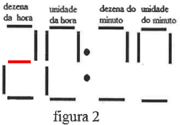

# Questão 8

O *display* de um relógio digital que está situado na sala de aula do aluno João é formado por lâmpadas que podem ser ligadas ou desligadas de forma independente. Cada dígito pode ser composto por até 7 (sete) lâmpadas ligadas e o display é formado por 4 (quatro) blocos (dezena da hora, unidade da hora, dezena do minuto, unidade do minuto), conforme a figura 1.

No entanto, o relógio dessa sala de aula está com defeito.

Nos quatro blocos, exatamente as mesmas duas lâmpadas de cada bloco queimaram e se mantém desligadas.

Considere que no exato momento em que João olha para o relógio, o horário mostrado é o da representação da figura 2:

Com relação à figura 2, qual será a representação do relógio passados 21 (vinte e um) minutos após João tê-lo olhado?

(A)

(B)

(C)

(D)

(E)

  
Resolução

  
  ## Resolução

  Observando o dígito referente às dezenas de hora, sabendo que as horas vão de 00 até 23, poderíamos pensar que as 2 possibilidades são 2:

  

  Ou 0 (zero):

  

  Porém, observando o dígito referente às unidades de hora, vemos que das 7 lâmpadas, 5 estão acesas. Assim, a única possibilidade é que as lâmpadas queimadas sejam a central e a inferior direita.

  

  Com isso, voltando para as dezenas de hora, eliminamos a possibilidade de ser 0 (zero), pois a lâmpada superior esquerda precisaria estar acesa, mas não está. Sendo assim, a conclusão é que este dígito é o 2, ou seja, o dígito para unidades de horas só pode ser o 0, pois é o único valor que pode formar uma hora válida (20, 21, 22, 23), dadas as lâmpadas que já estão acesos.

  Agora vamos pensar nos minutos. Nas dezenas só podemos ter o dígito 3, pois não tem como formar algo válido acendendo somente 1 das lâmpadas queimadas. E nas unidades só pode ser o dígito 9, pelos mesmos motivos.

  

  Assim, concluímos que quando João olha para o relógio são 20:39h, e quando se passam 21 minutos, chegamos a 21:00h, mas não podemos marcar a alternativa (B) por conta das lâmpadas queimadas, então temos que imaginar como seria a representação de 21:00h com os lâmpadas central e inferior direita apagadas.

  

  > Resposta: Alternativa (C)

