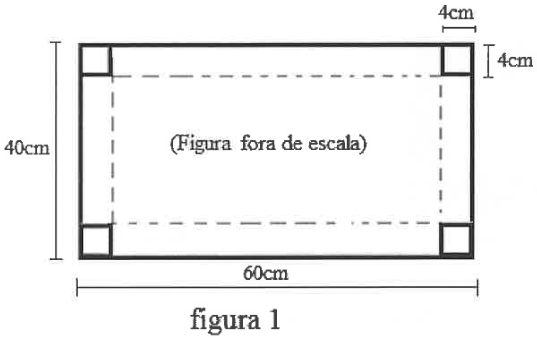
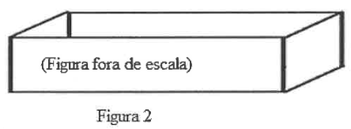
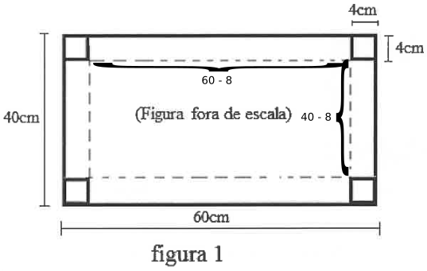
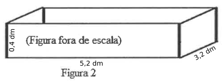

# Questão 9

Marquinhos tem uma folha de cartolina no formato de retângulo com 60 cm x 40 cm e recortou, nos cantos, 4 quadradinhos de lado 4 cm, conforme indica a figura 1.

Posteriormente dobrou a cartolina nas linhas pontilhadas e construiu uma caixa em forma de paralelepípedo sem tampa conforme a figura 2.

Qual a capacidade da caixa correspondente à figura 2, em decímetros cúbicos?

(A) 6,656 dm³

(B) 16,64 dm³

(C) 26,624 dm³

(D) 66,56 dm³

(E) 665,6 dm³

  
Resolução

  
  ## Resolução

  A base do paralelepípedo possui lados iguais a 52 cm (60 cm - 8 cm) e 32 cm (40 cm - 8 cm), pois descontamos os lados dos quadrados removidos. A altura do paralelepípedo é, naturalmente, 4 cm.

  

  Convertendo em dm, as dimensões são 5,2 dm, 3,2 dm e 0,4 dm. E o volume é calculado pelo produto destes 3 valores:

  \\( \text{volume do paralelepípedo} = \text{5,2} \times \text{3,2} \times{0,4} = \text{6,656}\\) dm³

  

  > Resposta: Alternativa (A)

