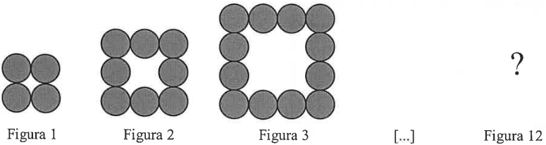

# Questão 10

Em virtude da quarentena e com as aulas suspensas, Carlos comprou uma grande quantidade de bolinhas de gude para que seu filho João pudesse brincar no quintal de casa.

João ordenou as bolinhas de gude representando quadrados conforme as figuras abaixo.

Supondo que João mantenha o padrão, quantas bolinhas ele irá utilizar para construir a figura 12?

(A) 169

(B) 121

(C) 48

(D) 44

(E) 52

  
Resolução

  
  ## Resolução
  É possível encontrar uma lei de formação neste padrão. Observe que na Figura 1, temos um quadrado 2x2. Na Figura 2, temos um quadrado 3x3, descontando um quadrado 1x1. Na Figura 3, temos um quadrado 4x4 descontando um quadrado 2x2. Podems reescrever essas relações como:

  Figura 1: (1+1)x(1+1) - 0 = (1+1)x(1+1) - (1-1)x(1-1)

  Figura 2: (2+1)x(2+1) - (1)x(1) = (2+1)x(2+1) - (2-1)x(2-1)

  Figura 3: (3+1)x(3+1) - (2)x(2) = (3+1)x(3+1) - (3-1)x(3-1)

  Agora sim, temos um padrão. Para a Figura N, teremos (N+1)x(N+1) - (N-1)x(N-1) bolinhas. Para o caso da figura 12, são (12+1)x(12+1) - (12-1)x(12-1) = 13x13 - 11x11 = 169 - 121 = 48 bolinhas.

  > Resposta: Alternativa (C)

